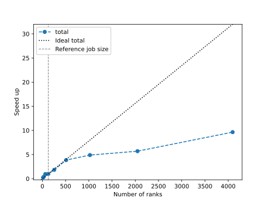
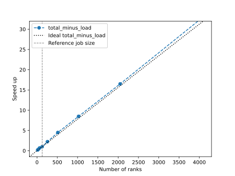
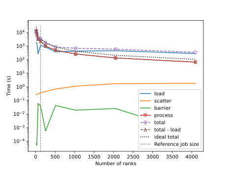

# Strong scaling tests
## How to reproduce

Clone this repo on DIRAC, then from within the `hydra-pspec` dir,
set up the python venv:

```
module load python/3.12.4
python3 -m venv .venv
source .venv/bin/activate
module load intel_comp/2020-update2
module load intel_mpi/2020-update2
pip install .
```

Each baseline is identical, so we use a script to duplicate and
organise the data.
The [test data][test_data] used for this is all in one directory e.g. `~/scaling-data`
where `ls` would give:

```
eor-cov.npy      fake-telescope.yaml  noise-cov.npy  obsparams-select.yaml  vis-eor-fgs.uvh5
fake-antpos.csv  fgmodes.npy          noise.npy      README                 vis-eor.uvh5
```

Then to duplicate and structure the data in a way that `hydra-pspec` is expecting, run:

```
python set_up_scaling_data.py --data_dir=${HOME}/scaling-data --num_baselines=4096 --dest_dir=scaling-data
```

The slurm jobscripts are created, and submitted like this,
using 256 ranks (cores) as an example:

```
bash create_jobscript.sh 256
sbatch jobscript_256ranks_strongscaling.sh
```

The results are saved in a subdirectory in `results/strong_scaling/`.

Then to create scaling plots
```
source .venv/bin/activate
python plot_speed_up.py --results_dir=results/strong_scaling
```

The default option here looks at total time, using the smallest job size (fewest ranks)
as the reference job size, but `python plot_speed_up.py --help` show the options available
for using different timers, or number of ranks as the reference job.

## Results
We have run hydra-pspec (commit ID 53474e02f3c46905669031476d3581140469f56f)
using the example with 4096 identical baselines,
and fixed the random seed. As such we got identical results for all baselines and
job sizes, which is what we wanted for scaling tests - the idea being that we have
removed any variability from some baselines taking longer to process than others.

Running the code using MPI, we varied the number of ranks using
16, 32, 64, 128 (1 whole node), 256, 512, 1024, 2048, 4096 ranks.
The scaling results depend slightly on what you take as the "reference" job size,
and we use 128 ranks as the reference here.
Shown below are speed up plots when considering the total run time,
and another which looks at the total time minus the load time.





We can see from these that the actual processing time (approximated as total - load)
scales very well,
but the total run time didn't scale well at larger numbers of ranks.

Considering the plot below of time vs ranks,
we see there is a large variability in file load times which we can't control,
and also that the load time starts to dominate the total run time at larger numbers of ranks.
As such, a clear area to investigate for improved scaling would be for each rank to load its own
subset of the baselines to process,
rather than one rank loading everything and then scattering the data.
The actual scatter doesn't appreciably affect the total time, nor is there
much wait time at the barrier at the end.



A [subset of the results][results], including the timing logs and one set of output files
(because the output is identical for every baseline pair) can be used to recreate
the above plots.

[test_data]: https://github.com/user-attachments/files/16455077/scaling-data.tar.gz
[results]: https://github.com/user-attachments/files/16455075/results.tar.gz
